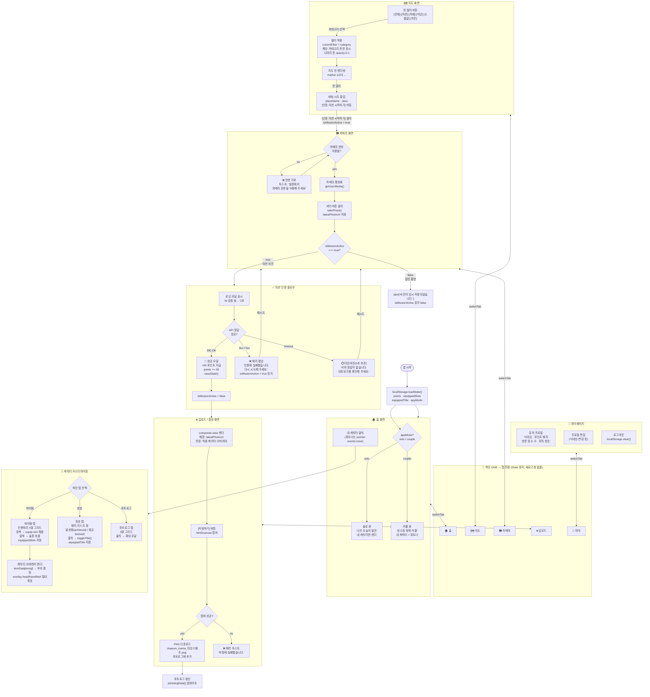

# 채움 앱 워크플로우 — 개선판

> [!IMPORTANT]
> 원본 대비 추가된 항목: **GNB 라우팅 흐름**, **에러/예외 처리 분기**, **API 파라미터 명세**, **지도 핀 필터 로직**, **localStorage 상태 유지 흐름**

---

## 전체 아키텍처 흐름



---

## API 명세 (핵심 파라미터)

```mermaid
sequenceDiagram
    participant APP as 앱 (Frontend)
    participant API as 채움 API (Backend)
    participant DB as Supabase DB

    Note over APP,DB: 미션 인증 플로우

    APP->>API: POST /api/missions/verify
    Note right of APP: Body: {<br/>  userId: "uuid",<br/>  missionId: "mission_001",<br/>  photoUrl: "data:image/png;base64,...",<br/>  locationLat: 37.5665,<br/>  locationLng: 126.9780,<br/>  timestamp: "2026-05-28T13:00:00Z"<br/>}

    API-->>APP: 200 OK
    Note left of API: Response: {<br/>  success: true,<br/>  pointsEarned: 50,<br/>  totalPoints: 1758,<br/>  missionStatus: "completed"<br/>}

    API->>DB: INSERT missions_log(userId, missionId, photoUrl, verifiedAt)
    API->>DB: UPDATE users SET points = points + 50

    APP->>API: POST /api/photos/upload
    Note right of APP: Body: {<br/>  userId: "uuid",<br/>  imageData: "base64...",<br/>  missionId: "mission_001",<br/>  compositeType: "chill_guy"<br/>}

    API-->>APP: 200 OK
    Note left of API: Response: {<br/>  photoId: "photo_uuid",<br/>  storedUrl: "https://cdn.chaeum.app/...",<br/>  createdAt: "2026-05-28T13:05:00Z"<br/>}
```

---

## 보완된 주요 항목 요약

| 구분 | 원본 문제 | 개선 내용 |
|------|-----------|-----------|
| **1. GNB 라우팅** | 화면 간 연결 화살표 없음 | 모든 탭에서 `switchTab()` 양방향 화살표 추가, 상태(State) 유지 명시 |
| **2. 예외 처리** | 해피패스만 존재 | 카메라 권한 거부, API 오류(4xx/5xx), 타임아웃, 캡처 실패 → 각 Fallback UI 분기 추가 |
| **3. API 파라미터** | 추상적 텍스트만 존재 | Sequence Diagram으로 Request/Response body 필드 전체 명세화 |
| **4. 빈 타원 노드** | 5개 미완성 타원 | 핀 카테고리 필터(전체/미션/카페/식당/소품샵/히든) 로직으로 구체화 |
| **5. 로컬스토리지** | 언급 없음 | 앱 시작 시 `loadState()` 흐름 명시 |
| **6. 아이템 오버레이** | 언급 없음 | `itemData` → 부위 분류 → 절대좌표 렌더링 흐름 추가 |
| **7. 칭호 시스템** | 언급 없음 | `toggleTitle()` 탈부착 분기, `equippedTitle` 저장 흐름 추가 |
