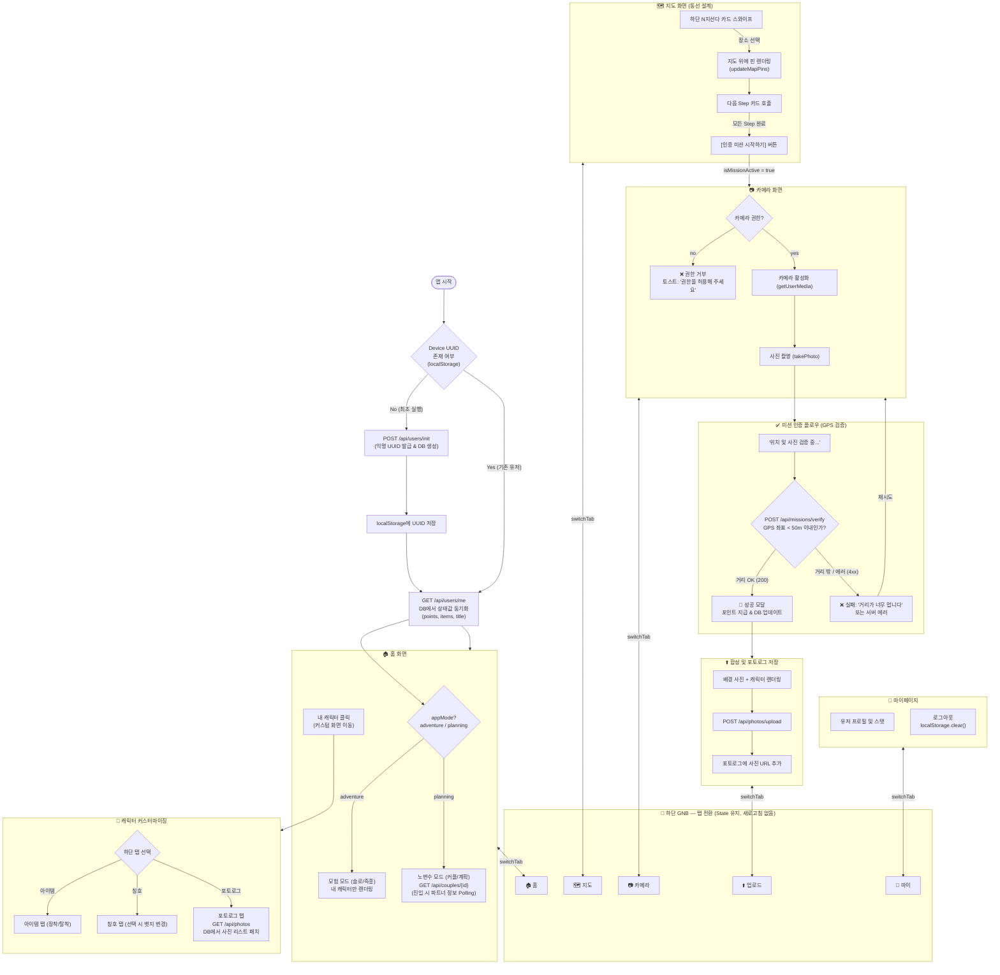
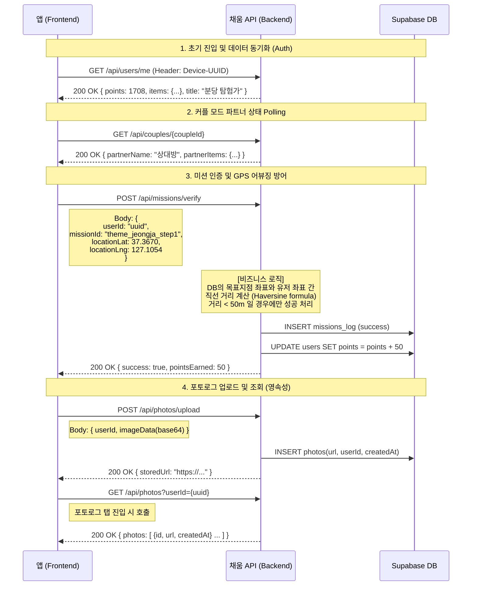

# 채움 앱 전체 아키텍처 및 API 명세 워크플로우

> 🚨 **크리티컬 블로커 개선판**: 초기 진입 Auth(UUID 동기화), 파트너 데이터 Polling, 미션 50m GPS 반경 검증, 포토로그 영속성(GET 호출) 로직이 추가되었습니다.

---

## 1. 전체 아키텍처 흐름

---

## 2. 세부 API 명세 (Sequence Diagram)

